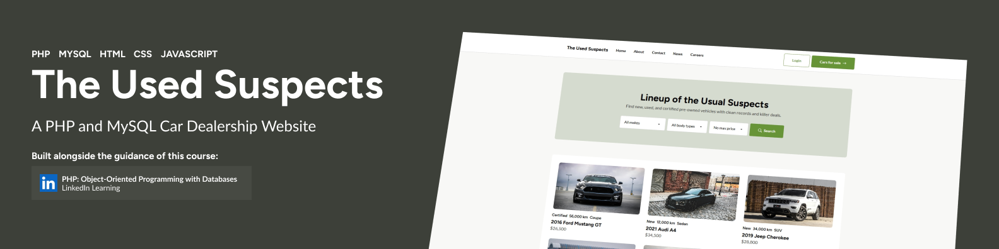
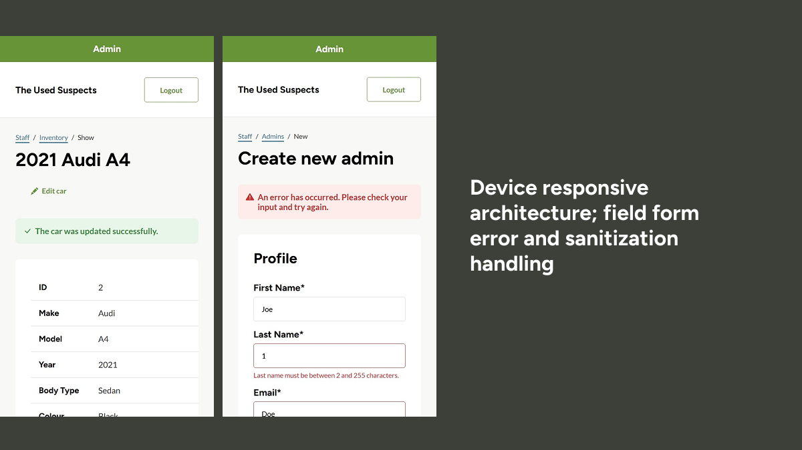

# Car Dealership Website

A PHP and mySQL object oriented-based web application for managing and displaying cars for sale, with car inventory and admin management features.

## Key Features

-   Public-facing car listings with details and images
-   Admin/staff dashboard for managing cars and users
-   User authentication (login/logout)
-   Pagination for car listings
-   File upload for car images (with unique file naming)
-   Responsive navigation and modern UI

## Requirements

-   PHP 7.4+
-   MySQL/MariaDB
-   Web server (Apache recommended, XAMPP compatible)

## Setup Instructions

1. Clone or download this repository.
2. Import `car_dealership.sql` into your MySQL database.
3. Configure your database credentials in `private/database_credentials.php`.
4. Place the project in your web server's root directory (e.g., `htdocs` for XAMPP).
5. Access the site via your browser (e.g., `http://localhost/Car-Dealership-Website/public/`).

## Example Account Login

You can use the following example admin account to log in:

<pre>
Username: JohnDoe123
Password: MySecure!Pass123
</pre>

## Usage

-   Public users can browse cars, view details, and contact the dealership.
-   Staff/admin users can log in to manage car listings and user accounts.

## Customization

-   Add or modify car makes, models, and options in the `Car` class.
-   Update styles in `public/stylesheets/`.
-   Add JavaScript functionality in `public/js/`.

## Security Notes

-   The `private/` directory is not web-accessible for security.
-   Uploaded files are renamed with unique IDs to prevent conflicts.
-   Always validate and sanitize user input.

## Disclaimer

This project was completed by following along with the LinkedIn Learning courses:

-   _PHP: Object-Oriented Programming with Databases_

The code and structure closely reflect the instructional content provided in these courses, and the project was developed as part of a personal learning exercise.
